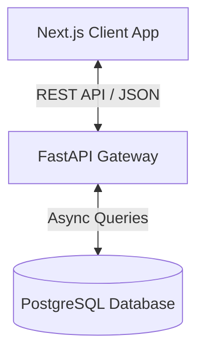

# CareerOS AI — AI-Powered Resume Builder & Analyzer

CareerOS AI is a premium career intelligence platform designed to build, audit, and target resumes using state-of-the-art AI. The platform evaluates resume score indicators, identifies keyword gaps compared to job descriptions, and supports an honest "Evidence Mode" that links AI recommendations directly to career history or explicit user verification.

---

## 🚀 Core Features
1. **AI Resume Analysis**: Explains ATS compatibility scores across 7 distinct categories.
2. **Job Description Matcher**: Scans target JDs and highlights skill gaps, missing keywords, and profile recommendations.
3. **Evidence Mode**: Highlights AI inferences with complete sources (e.g. verified profile entries vs. AI inference) to prevent fabrications.
4. **Smart Career Profile**: Stores details on education, experience, and skills in a unified repository to populate multiple targeted resumes.

---

## 💻 Technology Stack
- **Frontend**: Next.js 16 (App Router), TypeScript, Tailwind CSS, shadcn/ui components, Framer Motion, TanStack Query, React Hook Form, Zod, Lucide Icons.
- **Backend**: Python, FastAPI, SQLAlchemy, Alembic migrations, Pydantic validation, PostgreSQL database.
- **Infrastructure**: Docker Compose, pg_isready healthchecks.

---

## 🏛️ Architecture Overview
CareerOS AI is organized as a monorepo containing completely isolated frontend and backend folders. Communication is decoupled and runs exclusively via HTTP REST APIs.



---

## 📁 Folder Structure
```
ai-resume-builder/
├── frontend/             # Next.js Application
│   ├── app/              # App Router Pages & Layouts
│   ├── components/       # Layout, Shared & UI components
│   ├── lib/              # API clients & validations
│   ├── providers/        # Context Providers
│   └── types/            # TypeScript type contracts
├── backend/              # FastAPI Application
│   ├── app/
│   │   ├── api/          # Endpoints & Dependencies
│   │   ├── core/         # Core config & Security
│   │   ├── db/           # Session management & ORM Models
│   │   ├── schemas/      # Pydantic schemas
│   │   └── services/     # AI matching, scoring & parsing logic
│   ├── alembic/          # DB Migration scripts
│   └── tests/            # Integration Pytest files
├── docker-compose.yml    # Postgres 16 docker config
└── README.md
```

---

## ⚙️ Setup & Prerequisites
Ensure you have the following installed locally:
- **Node.js**: v20+
- **Python**: v3.10+
- **Docker & Docker Compose**

### 1. Environment Setup

#### Backend configuration
Create `backend/.env` based on `backend/.env.example`:
```bash
cp backend/.env.example backend/.env
```
Fill out required values (e.g. `DATABASE_URL`, `SECRET_KEY`, `AI_API_KEY`).

#### Frontend configuration
Create `frontend/.env.local` based on `frontend/.env.example`:
```bash
cp frontend/.env.example frontend/.env.local
```

### 2. Database Launch (Docker Compose)
Start the PostgreSQL container:
```bash
docker compose up -d postgres
```
This runs PostgreSQL 16 on port `5432` with username/password `postgres`/`postgres` and database name `careeros`.

---

## 🚀 Running Locally

### Backend Development
1. Navigate to backend:
   ```bash
   cd backend
   ```
2. Create and activate virtual environment:
   ```bash
   python -m venv .venv
   source .venv/bin/activate
   ```
3. Install dependencies:
   ```bash
   pip install -r requirements.txt
   ```
4. Start FastAPI server:
   ```bash
   uvicorn app.main:app --reload --port 8000
   ```
   Server runs at [http://localhost:8000](http://localhost:8000). Interactive Swagger documentation is at `/docs`.

### Frontend Development
1. Navigate to frontend:
   ```bash
   cd frontend
   ```
2. Install dependencies:
   ```bash
   npm install
   ```
3. Launch Next.js dev server:
   ```bash
   npm run dev
   ```
   Client app runs at [http://localhost:3000](http://localhost:3000).

---

## 🧪 Testing and Validation

- **Run Backend Tests**:
  ```bash
  pytest
  ```
- **Run Frontend Linters & Typecheck**:
  ```bash
  npm run lint
  npm run build
  ```

---

## 🔒 Security Notes
- JWT authentication is used. Session tokens are short-lived.
- Database access is fully parameterized using SQLAlchemy ORM to prevent SQL Injection.
- Access secrets and API keys must never be committed to git or exposed to the client.

---

## 📈 Current Implementation Status
- **Phase 1 & 2**: Core UX logic, dark landing page, time-aware greeting, resume document grid layout, interactive profile tags, and JD matcher forms.
- **Phase 3**: Clean monorepo foundation, standardized API clients, mobile drawer sheet layout, and FastAPI health checkpoints.
