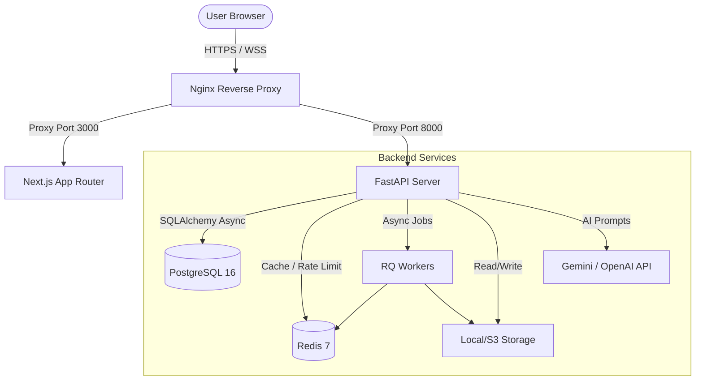

# CareerOS AI — Ultimate Career Intelligence Platform

> **CareerOS AI** is a state-of-the-art, end-to-end career platform designed to help candidates land their dream roles. Moving beyond simple resume builders, it offers deep career analytics, automatic application tracking, tailored cover letters, AI-powered interview prep, interactive skill roadmaps, and recruiter tools.

---

## 🚀 Key Feature Areas

### 📄 Intelligent Resume Engine
*   **ATS-Safe Templates:** Premium layouts designed to clear corporate applicant parsing systems.
*   **Live Preview & PDF Export:** Seamlessly compile and preview resumes, with offline snapshot history.
*   **Version History:** Dynamic tracking with Optimistic Concurrency Control (OCC) protecting multi-session edits.

### 🔍 Deep Analysis & JD Matching
*   **Explainable ATS scoring:** Clear diagnostics highlighting critical errors, grammar check-ins, and keyword densities.
*   **Intelligent JD Matcher:** Paste a target job description and get precise matching analytics.
*   **Grounded AI Suggestions:** Direct recommendations mapped to concrete, verifiable professional claims.

### 🛡️ Grounded Credibility (Evidence Mode)
*   **Claims Verification:** Extract and score professional claims for truthfulness, clarity, and impact.
*   **Credibility Scoring:** An audit engine checking evidence sources, detecting hyperbole, and rating resume trust.
*   **Evidence Audits:** Seamless mapping of resume statements to verifiable links or internal documents.

### 💼 Career Intelligence Suite (Phase 15/16 additions)
*   **Application Kanban Board:** Track recruiting pipelines with multi-stage drag-and-drop lists.
*   **Cover Letter Generator:** Generate personalized, context-aware cover letters for specific job applications.
*   **LinkedIn Profile Optimizer:** Scan and improve your LinkedIn presence with structured suggestions.
*   **Portfolio Builder:** Auto-generate gorgeous personal portfolio pages directly from resume snapshots.
*   **Interactive Q&A Prep:** Practice AI-simulated interview questions with instant grading and audio/text feedback.
*   **Milestone Roadmaps:** Step-by-step career path projections with target skill checklists.
*   **Recruiter Portal:** Dedicated workspace allowing recruiters to search, review, and filter top candidates.

---

## 🏛️ System Architecture



### Technology Matrix

| Layer | Technologies | Purpose |
| :--- | :--- | :--- |
| **Frontend** | Next.js 16 (App Router), React, TailwindCSS v4, shadcn/ui, Lucide Icons | Premium, responsive Web Interface |
| **Backend** | FastAPI, Pydantic v2, Uvicorn, Python 3.11+ | High-performance async REST API |
| **Database** | PostgreSQL 16 (production), SQLite (development), SQLAlchemy ORM, Alembic | Data persistency, schema migrations |
| **Caching & Jobs** | Redis 7, Redis Queue (RQ) | Rate limiting, async PDF compiles, and task queues |
| **Storage** | Local filesystem / AWS S3 / Google Cloud Storage | Compiled resume snapshots and exports |

---

## 🛠️ Quick Start

### 1. Clone & Set Up the Workspace

```bash
# Clone the repository
git clone https://github.com/your-username/ai-resume-builder.git
cd ai-resume-builder
```

### 2. Run with Docker (Recommended)

To start the entire environment (PostgreSQL, Redis, Backend, Frontend, Nginx) with a single command:

```bash
# Build and run the stack
docker compose up --build
```
*   **Frontend UI:** [http://localhost:3000](http://localhost:3000)
*   **Backend Server:** [http://localhost:8000](http://localhost:8000)
*   **Interactive Swagger Docs:** [http://localhost:8000/docs](http://localhost:8000/docs)

### 3. Manual Development Setup

#### Backend:
```bash
cd backend
python -m venv .venv
source .venv/bin/activate
pip install -r requirements.txt

# Configure environment
cp .env.example .env
# Set DATABASE_URL=sqlite+aiosqlite:///./careeros.db for local dev

# Run migrations
alembic upgrade head

# Seed candidate & recruiter mock data (Demo Mode)
python scripts/seed_demo.py

# Start Server
uvicorn app.main:app --reload --port 8000
```

#### Frontend:
```bash
cd frontend
npm install
npm run dev
```

---

## 📊 Demo User Credentials

The database comes pre-seeded with candidate and recruiter workspaces:

| Role | Username / Email | Password | Details |
| :--- | :--- | :--- | :--- |
| **Candidate** | `demo@careeros.ai` | `Demo1234!` | Preloaded with 3 resume versions, tracking board, cover letters, and roadmaps. |
| **Recruiter** | `recruiter@careeros.ai` | `Recruiter1234!` | Preloaded with candidate lists, resume search indices, and screening pipelines. |

---

## 🧪 Testing

```bash
cd backend
source .venv/bin/activate

# Run the complete test suite
pytest

# View test coverage
pytest --cov=app --cov-report=html
```

---

## 🔒 Production Readiness & Hardening

*   **Security Header Protection:** Configured HSTS, Content Security Policy (CSP), X-Frame-Options, and X-Content-Type-Options.
*   **Rate Limiting:** Redis-backed rate limiting protects sensitive endpoints (login, register, AI suggestions).
*   **Database Constraints:** Optimistic Concurrency Control (OCC) handles parallel resume edits gracefully.
*   **Zero Leakage:** Global exception handler blocks stack traces or SQLAlchemy statements from leaking in API responses.

---

*CareerOS AI — Production Hardening & Launch Readiness 2026*
