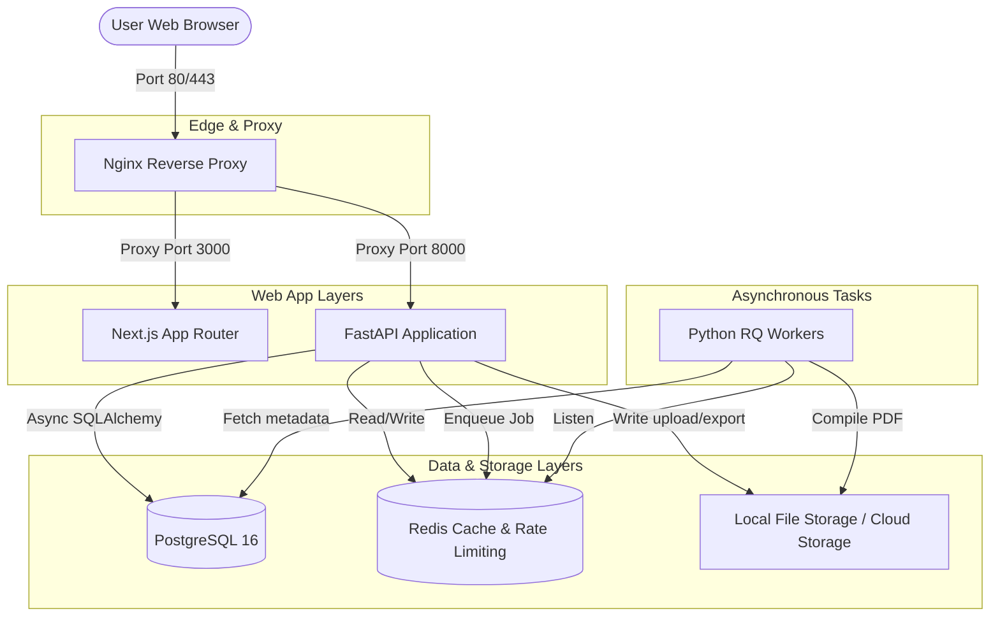
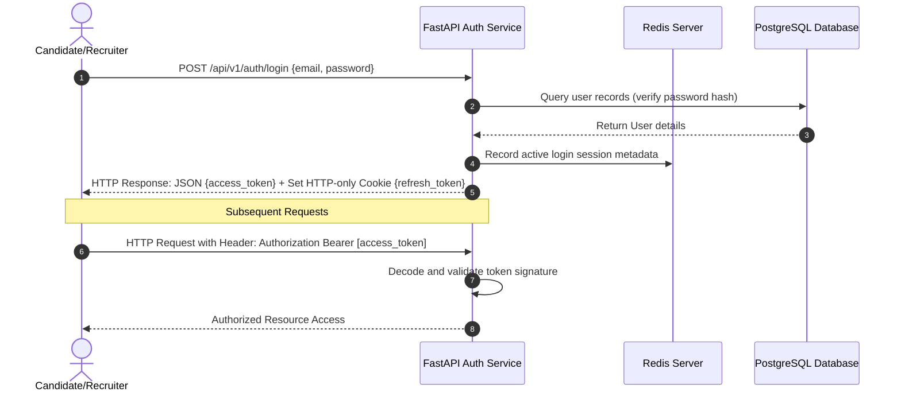
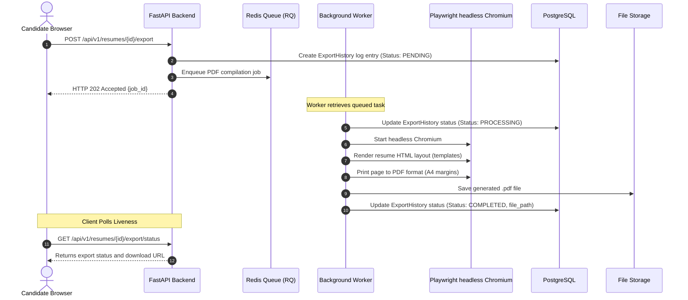
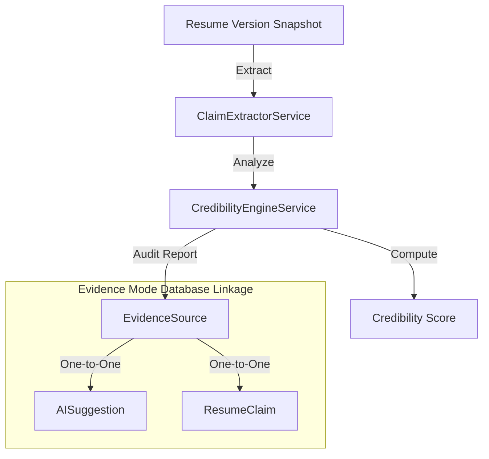

# System Architecture & Design

This document details the system design, data flow, authentication, asynchronous jobs, and database architecture of the **CareerOS AI** platform.

---

## 🗺️ System Topology

CareerOS AI is designed with a service-oriented, containerized topology. The user interacts through a reverse proxy (Nginx) which directs requests to the Next.js frontend or the FastAPI backend.

---

## 🔑 Authentication Flow

CareerOS AI uses JWT (JSON Web Tokens) with a short-lived access token (30 minutes) and a long-lived refresh token (7 days). Refresh tokens are stored securely in HTTP-only, SameSite cookies.

---

## 📄 Resume PDF Compile & Export Pipeline

PDF rendering is processed asynchronously via background workers (Python RQ) utilizing headless Playwright.

---

## 🛡️ Grounded Credibility & Evidence Mode

To verify resume claims and generate trust scores, CareerOS AI employs an exclusive **Evidence Mode** pipeline:

*   **ClaimExtractorService:** Uses NLP to extract verifiable claims (e.g. "Increased sales by 40%").
*   **CredibilityEngineService:** Analyzes claim properties, checking for exaggerations, missing data, and links matching claims to verify credibility.
*   **CheckConstraint Enforcer:** Enforces `(ai_suggestion_id IS NULL) <> (resume_claim_id IS NULL)` ensuring that a source is exclusively linked to either a claim or a suggestion, but never both.
